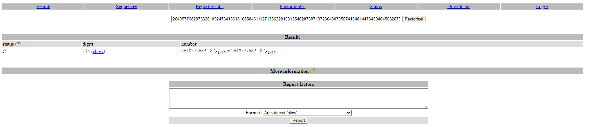
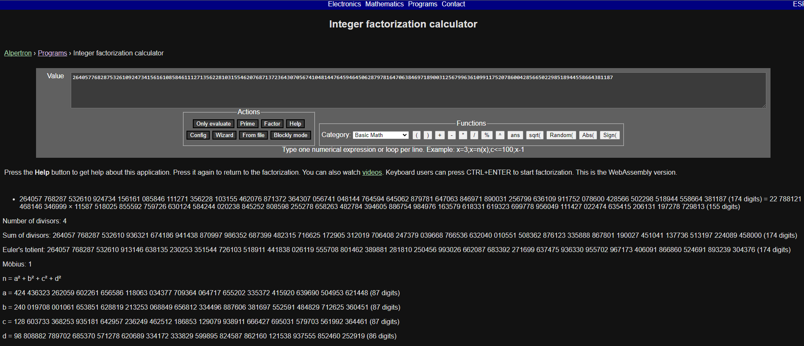

## Crypto/sifers
We are given the following :
```
0ujyfwa87u
M25jMGQxbmc=
GRXGI===
2eac7797ba995850a0372814e2a7ba87 
00110100 01101100 01101100
64 162 63
q4ss6e6ag
65 62 32 35 64 38 62 37
```
The name of the challenge combined with the given text brings us to think that each line is a seperate encoding that we have to decode.
### The first line
`0ujyfwa87u`
is a Caesar Cipher where digits are being shifted by 3 on their own alphabet and the letters are being shifted by 19 on their own alphabet. 
```python
ct="0ujyfwa87u"
pt = ""
for i in ct :
    if i in "0123456789" :
        pt+= chr ( (ord(i) - ord('0') + 3 ) % 10  +  ord('0'))
    else :
        pt+= chr ( (ord(i) - ord('a') + 19) % 26 + ord('a'))
print(pt)
```
This gives us the first part of the flag `3ncrypt10n`

### The second line 
`M25jMGQxbmc=` is base64 encoding which can be decoded using [https://www.base64decode.org/](https://www.base64decode.org/) which gives us the second part of the flag `3nc0d1ng`
### The third line 
`GRXGI===` required a bit more effort.
After more trial and error we realize that using [https://www.dcode.fr/base-32-encoding](https://www.dcode.fr/base-32-encoding) and decoding it  as a Base32 gives us the third part of the flag `4nd`

### The fourth line
`2eac7797ba995850a0372814e2a7ba87` is a MD5 hash which can be decoded using [https://md5decrypt.net/](https://md5decrypt.net/) and gives the fourth part of the flag `h4sh1ng`

### The fifth line 
`00110100 01101100 01101100` is just binary which can be decoded directly into ASCII which gives us the fifth part of the flag `4ll`

### The sixth line
`64 162 63` is just octal which can be decoded directly into ASCII which gives us the sixth part of the flag `4r3`
### The seventh line
`q4ss6e6ag` is similar to the first line where digits are shifted to the left by 3 and letters are shifted to the right by 13
``` python
ct = "q4ss6e6ag"
pt = ""
for i in ct :
    if i in "0123456789" :
        pt+= chr ( (ord(i) - ord('0') - 3 ) % 10  +  ord('0'))
    else :
        pt+= chr ( (ord(i) - ord('a') + 13) % 26 + ord('a'))
print(pt)
```
gives us the seventh part of the flag `d1ff3r3nt`
### The eighth line
`65 62 32 35 64 38 62 37`
is just hex which can be directly decoded to ASCII and give us the eighth and final part of the flag `eb25d8b7`

We are finally done!
Assembling the parts gives us our flag : `accessdenied{3ncrypt10n_3nc0d1ng_4nd_h4sh1ng_4ll_4r3_d1ff3r3nt_eb25d8b7}`

## Crypto/RSA-1
We are given the following:
```
p = 10428615258416108003372202871855627713663325599674460924186517713082197448534315449595394752587304354394402047262801959990727856908043138185588365886987557
q = 8849030739304056868757301096931487921973840186794195322071503751716059434197468028088264340322992996182734000877348221433845302801843370163430108727308579
e = 65537
cipher_text = 84826403344972753121997388456739256614537789930909176473018827332005543366933391914385410712984001888365906754988120732970328825657318675360778107518188000885732104031648548997976916964730682864696944786364581243443475767387970255510475855029059715864139791778210784283726274424510221073880200865856769716576
```
We know that N = PQ

Some basic knowledge of RSA is enough to realize we have to find d which is the inverse of e modulo Φ(N) = (P-1)(Q-1)

Raising our ciphertext to the power of d mod N gives us a decimal number that is the plaintext of the flag.  We convert the decimal number to Hex and then decode into ASCII which gives us our flag : `accessdenied{RSA_1S_4M4Z1nG_R1GhT????_2a5286af}`
```python
p = 10428615258416108003372202871855627713663325599674460924186517713082197448534315449595394752587304354394402047262801959990727856908043138185588365886987557
q = 8849030739304056868757301096931487921973840186794195322071503751716059434197468028088264340322992996182734000877348221433845302801843370163430108727308579
e = 65537
cipher_text = 84826403344972753121997388456739256614537789930909176473018827332005543366933391914385410712984001888365906754988120732970328825657318675360778107518188000885732104031648548997976916964730682864696944786364581243443475767387970255510475855029059715864139791778210784283726274424510221073880200865856769716576
def egcd(a, b):
    if a == 0:
        return (b, 0, 1)
    else:
        g, y, x = egcd(b % a, a)
        return (g, x - (b // a) * y, y)

def modinv(a, m):
    g, x, y = egcd(a, m)
    if g != 1:
        raise Exception('modular inverse does not exist')
    else:
        return x % m
phi = (p-1) * (q-1)
d = modinv(e,phi)
print(pow(cipher_text,d,p*q))
```
## Crypto/RSA-2


We are given the following:
```
N = 264057768287532610924734156161085846111271356228103155462076871372364307056741048144764594645062879781647063846971890031256799636109911752078600428566502298518944558664381187
e = 65537
ct = 175347248748800717331910762241898102719683222504200516534883687111045877096093372005991552193144558951747833811929393668749668731738201985792026669764642235225240342271148171
```
We immediately realize that N is way too small and we could probably factor it easily.


My first choice was [factordb.com](http://factordb.com/) which gives us the following:


It doesn't give us the factorization but tells us that N is composite which we already know since N = P x Q for primes P and Q.

My next choice was [https://www.alpertron.com.ar/ECM.HTM](https://www.alpertron.com.ar/ECM.HTM) which gives us:


We have found P and Q such that N = P x Q. Now we are pretty much done, we first calculate d which is the inverse of e modulo Φ(N) = (P-1)(Q-1). Now we raise our ciphertext to the power of d mod N which gives us a decimal number that is the plaintext of the flag. We convert the decimal number to Hex and then decode into ASCII which gives us our flag : `accessdenied{alw4y5_try_t0_f4ct0r1z3_n_9ba93547}`
```python
n   = 264057768287532610924734156161085846111271356228103155462076871372364307056741048144764594645062879781647063846971890031256799636109911752078600428566502298518944558664381187
p   = 22788121468146346999
q   = 11587518025855592759726630124584244020238845252808598255278658263482784394605886754984976163579618331619323699778956049111427022474635415206131197278729813
phi = (p-1) * (q-1)
e   = 65537
ct  = 175347248748800717331910762241898102719683222504200516534883687111045877096093372005991552193144558951747833811929393668749668731738201985792026669764642235225240342271148171
def egcd(a, b):
    if a == 0:
        return (b, 0, 1)
    else:
        g, y, x = egcd(b % a, a)
        return (g, x - (b // a) * y, y)

def modinv(a, m):
    g, x, y = egcd(a, m)
    if g != 1:
        raise Exception('modular inverse does not exist')
    else:
        return x % m

assert(p*q==n)
d = modinv(e,phi)
print(pow(ct,d,n))
```

## Crypto/Small key

We are given the following:

```python
import os

flag = b"XXXXXX"
key = os.urandom(8)

cipher_text = b""

for i in range(len(flag)):
    cipher_text += bytes([flag[i] ^ key[i % 8]])


print(cipher_text.hex())


# flag 763d32726973a23f79373473616ba86a60300e677634f734482a626f6e5ff22e636a327c2f5ff228240123242e6caa23483d6127765fff6d743a61212f38bb
```
We observe that the key used for the One-time pad is only 8 bytes. Since each byte is decoded into 1 UTF-8 character we know that our key is exactly 8 characters long.

We also know the first 8 characters of the plaintext are going to be "accessde" since the flag format is accessdenied{}. With this knowledge can leak the entire key
by XORing the first 8 characters of the flag (after converting it from Hex to a byte object) with b"accessde". Now we use the key to decrypt the flag which gives us our flag:
`accessdenied{kn0wn_pl41n_t3xt_4tt4ck5_4r3_r34lly_c00l_97cd0658}`
```python
import binascii


flag = binascii.unhexlify("763d32726973a23f79373473616ba86a60300e677634f734482a626f6e5ff22e636a327c2f5ff228240123242e6caa23483d6127765fff6d743a61212f38bb")
starting_8_bytes_of_flag = binascii.unhexlify("763d32726973a23f")
starting_8_bytes_of_plaintext= b"accessde"
key = b""
for i in range(len(starting_8_bytes_of_flag)):
    key += bytes([starting_8_bytes_of_flag[i] ^ starting_8_bytes_of_plaintext[i % 8]]) 

plain = b""
for i in range(len(flag)):
    plain += bytes([flag[i] ^ key[i % 8]])
print(plain.decode())
```
